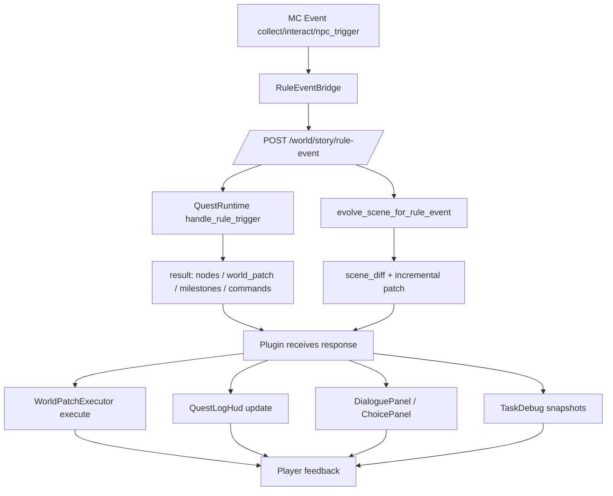

# DriftSystem Closed-Loop Diagram

## 1. Player Chat -> Intent -> Story -> World -> Rule Event

```mermaid
flowchart LR
    P[Player Chat] --> CL[PlayerChatListener]
    CL --> RE1[RuleEventBridge emitTalk]
    RE1 --> BE1[/POST /world/story/rule-event/]

    CL --> AI[/POST /ai/intent/]
    AI --> ID[IntentDispatcher2]

    ID -->|SAY_ONLY / STORY_CONTINUE| WA[/POST /world/apply/]
    ID -->|CREATE_STORY| SI[/POST /story/inject/]
    SI --> SL[/POST /story/load/{player}/{level}/]
    ID -->|GOTO_LEVEL| SL
    ID -->|SHOW_MINIMAP| MM[/GET /minimap/give/{player}/]

    WA --> WPR[world_patch + story_node]
    SL --> BSP[bootstrap_patch]
    MM --> MPG[map_image payload]

    WPR --> EX[SceneAwareWorldPatchExecutor]
    BSP --> EX
    MPG --> EX

    EX --> AR[/POST /world/apply/report/]
    EX --> WR[World changed in MC]

    WR --> RL[RuleEventListener / NearbyNPCListener]
    RL --> RE2[RuleEventBridge emit*]
    RE2 --> BE1
```

## 2. Rule Event -> Quest Runtime -> Scene Evolution -> HUD



## 3. Runtime Scene Debug / Explain Loop

```mermaid
flowchart LR
    A[/taskdebug|debugscene|debuginventory/] --> D1[/GET /world/story/{player}/debug/tasks/]
    B[/predictscene/] --> D2[/GET /world/story/{player}/predict_scene/]
    C[/explainscene/] --> D3[/GET /world/story/{player}/explain_scene/]

    D1 --> R1[scene_generation + active_tasks + apply_report]
    D2 --> R2[prediction payload]
    D3 --> R3[explanation payload]

    R1 --> F[管理员判读并调整输入]
    R2 --> F
    R3 --> F

    F --> G[/spawnfragment or storyreset/]
    G --> S1[/POST /world/story/{player}/spawnfragment or /reset/]
    S1 --> U[scene_generation updated]
    U --> D1
```

## 4. Tutorial Exit Loop

```mermaid
flowchart LR
    T0[Player in tutorial] --> T1[TutorialManager check/start]
    T1 --> T2[completion emitted / finalize]
    T2 --> T3[/POST /story/load/{player}/flagship_03/]
    T3 --> T4[bootstrap_patch execute]
    T4 --> T5[QuestLogHud + normal story phase]
```

## 5. Loop Closure Definition

系统闭环成立条件：

- 输入闭环：命令输入与聊天输入都可进入同一世界补丁执行层。
- 反馈闭环：世界执行结果通过规则事件再回流到任务与场景演化。
- 可观测闭环：`debug/tasks`、`predict_scene`、`explain_scene` 可完整观测执行状态。
- 恢复闭环：`storyreset` 可将运行态回到可控起点。
