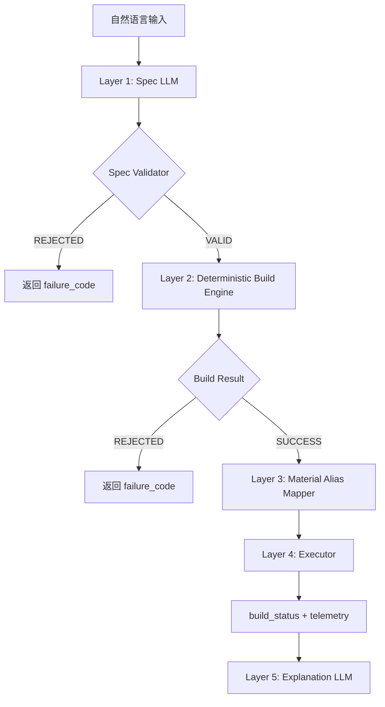

# Drift v2 分层可控生成架构

## 1) 目标

把“随机生成系统”收敛为“可控生成系统”：

- 去随机化：关键生成链路 deterministic。
- 去隐式回退：非法输入即拒绝。
- 分层解耦：LLM 只做提案，不做执行。

---

## 2) 五层架构

---

## 3) 层职责边界

### Layer 1 - Spec LLM

- 输入：自然语言。
- 输出：结构化 Spec。
- 禁止输出：block 列表、mc patch、执行字段。

### Validator

- 责任：字段完备性、枚举合法性、尺寸边界。
- 输出：`VALID/REJECTED + failure_code`。

### Layer 2 - Deterministic Build Engine

- 输入：VALID Spec。
- 输出：抽象 blocks（role + 坐标）。
- 约束：同 Spec 同输出；不使用随机。

### Layer 3 - Material Alias Mapper

- 输入：`material_preference + role`。
- 输出：白名单 MC block id。
- 映射缺失：直接 REJECTED。

### Layer 4 - Executor

- 输入：纯 blocks。
- 职责：执行并返回 build_status。
- 禁止：shape/material 默认值回退。

### Layer 5 - Explanation LLM

- 输入：Spec + 执行结果。
- 输出：说明文案。
- 不参与任何生成决策。

---

## 4) 收敛策略（最小改造路径）

### Phase 1（立即）

- 增加 Spec/Build 协议（文档 + 埋点字段）。
- 保留旧链路但打日志：`build_path` 区分旧/新。

### Phase 2（切流）

- 新请求走 `spec_engine_v1`。
- 旧 `LLM->world_patch` 保留为灰度后备，但默认关闭。

### Phase 3（收口）

- 移除执行层隐式 fallback。
- `INVALID_*` 统一走 REJECTED。

### Phase 4（稳定）

- Debug 面板强制显示：`build_status/failure_code/build_path/patch_source`。
- 以 failure_code 分布驱动优化。

---

## 5) 成功判据

- 同一输入重复 20 次：输出 blocks 哈希一致率 100%。
- `fallback` 触发次数降为 0（执行层无隐式回退）。
- `failure_code` 可统计且可归因。
- 木架占位从“静默出现”变为“显式拒绝 + 原因可见”。
