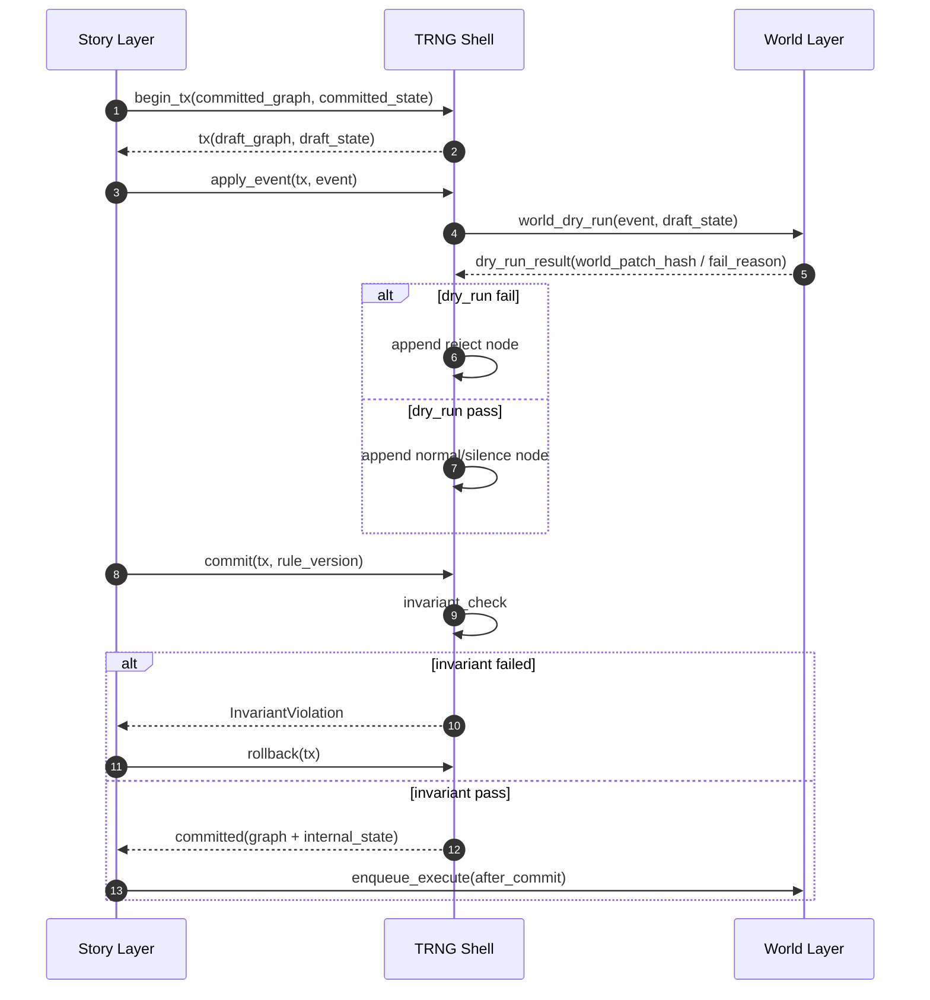

# Story → TRNG → World 三层时序图（Phase 3A）

## 说明
- 本图用于冻结接入顺序，不表示已接线。
- 强约束：World execute 必须 after-commit。

## 不可触碰边界
- TRNG 不决定 projection。
- TRNG 不直接执行 executor。
- TRNG 不读取世界实时状态。
- TRNG 不修改 payload/schema/rule gate。
